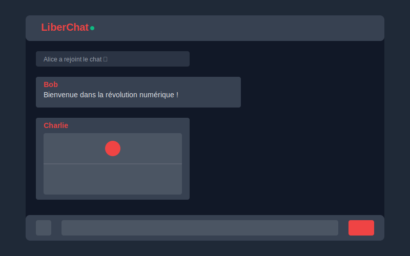

# LiberChat 🚩

LiberChat est une application de messagerie instantanée libre et open source, conçue pour offrir un espace de communication sécurisé et militant. Cette plateforme met l'accent sur la liberté d'expression tout en respectant les valeurs de gauche et l'éthique du logiciel libre.



## 🌟 Fonctionnalités

- 💬 Messagerie instantanée en temps réel
- 📸 Partage d'images et de vidéos
- 👥 Gestion des utilisateurs en temps réel
- 🔄 Messages système (entrées/sorties des utilisateurs)
- 📱 Interface responsive et adaptative
- 🖼️ Support du mode plein écran
- 🧹 Nettoyage automatique des fichiers après 24h

## 🛠️ Technologies Utilisées

- **Backend**
  - Node.js
  - Express.js
  - Socket.IO
  - Multer (gestion des uploads)

- **Frontend**
  - HTML5
  - JavaScript (Vanilla)
  - Tailwind CSS
  - Socket.IO Client

## 📋 Prérequis

- Node.js (v18.x ou supérieur)
- NPM (inclus avec Node.js)
- Un navigateur web moderne

## 🚀 Installation

1. Clonez le dépôt :
```bash
git clone [URL_DU_REPO]
cd liberchat
```

2. Installez les dépendances :
```bash
npm install
```

3. Démarrez le serveur :
```bash
node server.js
```

4. Accédez à l'application dans votre navigateur :
```
http://localhost:3000
```

## 🔧 Configuration

Par défaut, le serveur démarre sur le port 3000. Vous pouvez modifier ce comportement en :
- Définissant la variable d'environnement PORT
- Modifiant la valeur dans server.js

## 📁 Structure du Projet

```
liberchat/
├── public/
│   ├── index.html     # Interface utilisateur
│   └── uploads/       # Dossier des fichiers uploadés
├── server.js          # Serveur Node.js
├── package.json       # Dépendances et scripts
└── README.md          # Documentation
```

## 🔒 Sécurité

- Validation des fichiers uploadés (type et taille)
- Nettoyage automatique des fichiers après 24h
- Sanitization des entrées utilisateur
- Limitation de la taille des fichiers à 50MB

## 🤝 Contribution

Les contributions sont les bienvenues ! Voici comment vous pouvez aider :
1. Forkez le projet
2. Créez une branche pour votre fonctionnalité
3. Committez vos changements
4. Poussez vers la branche
5. Ouvrez une Pull Request

## 🐛 Bugs Connus

- Si le port 3000 est déjà utilisé, vous devrez en spécifier un autre

## 📜 Licence

Ce projet est sous licence libre [MIT License] - voir le fichier LICENSE pour plus de détails.

## ✨ Remerciements

- À la communauté open source
- Aux militants qui inspirent ce projet
- À tous les contributeurs


## 📞 Contact

Pour toute question ou suggestion, n'hésitez pas à :
- Ouvrir une issue
- Contribuer au projet
- Rejoindre la communauté

---

*Libérez votre communication ! ✊*
